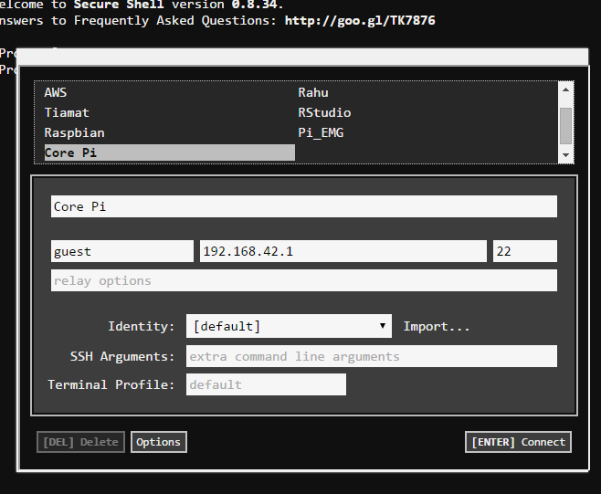
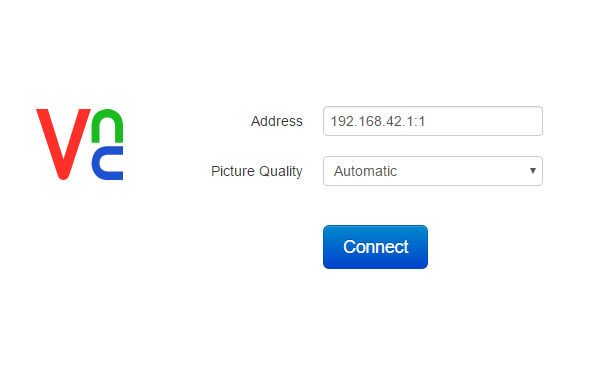

# Description

This guides a beginner to perform an initial setup of a Raspberry Pi. A coach should be nearby to assist when needed.

# Next up?

After reading this guide, you may be interested in reading:

# Overview

A coach provides:

+ a connected Core Pi
+ a MicroSD with Raspbian image installed
+ a Chrome browser with the Secure Shell and VNC Viewer apps installed

Some useful information is:

+ SSID to connect to is _corepi_
+ corepi wifi password is _raspberry_
+ Core Pi username/password is _guest/raspberry_
+ New pi username/password is _pi/raspberry_
+ Core Pi IP address is _192.168.42.1_
+ VNC passcode is _123456_

The steps to follow for easy setup are:

1. [Connect to Core Pi](#1)
2. [Attach your pi](#2)

## Connect to Core Pi

### Wifi access point

Using standard methods connect your computer to the corepi access point. The name is _corepi_ and the password is _raspberry_.

### SSH

[What is Secure Shell?](http://encyclopedia.kids.net.au/page/ss/SSH)

Use the Secure Shell app to connect to corepi. Start a [New Connection] and then then name your connection _Core Pi_. The username is _guest_, the hostname is _192.168.42.1_, and the port is _22_. No other information is needed and you may click _Connect_. Your information should appear similar to this image.

You will now see a prompt to enter a password. The password is _raspberry_. If you get an error message such as:

    @@@@@@@@@@@@@@@@@@@@@@@@@@@@@@@@@@@@@@@@@@@@@@@@@@@@@@@@@@@
    @ WARNING: REMOTE HOST IDENTIFICATION HAS CHANGED! @
    @@@@@@@@@@@@@@@@@@@@@@@@@@@@@@@@@@@@@@@@@@@@@@@@@@@@@@@@@@@
    IT IS POSSIBLE THAT SOMEONE IS DOING SOMETHING NASTY!
    Someone could be eavesdropping on you right now (man-in-the-middle attack)!
    It is also possible that a host key has just been changed.
    The fingerprint for the ECDSA key sent by the remote host is
    d6:be:12:7e:22:23:c3:e1:56:30:d6:cd:65:b7:ab:42.
    Please contact your system administrator.
    Add correct host key in /.ssh/known_hosts to get rid of this message.
    Offending ECDSA key in /.ssh/known_hosts:7
    ECDSA host key for xxxxxxxxxxxxx.yyy.au has changed and you have requested strict checking.
    Host key verification failed.
    NaCl plugin exited with status code 255.
    (R)econnect, (C)hoose another connection, or E(x)it?

talk to your coach. Your coach may choose to follow this [SSH hint](ssh_hints.html#Chrome_01).

### VNC

[What is VNC?](https://www.realvnc.com/support/faq.html#philosophy)

+ From SSH, the VNC server must be started on corepi, `vncserver :1`
+ Start the VNC Viewer app from Chrome
+ For the address, enter _192.168.42.1:1_
+ Your information should appear similar to this image.

+ Click enter
+ When requested, enter the passcode _123456_
+ You should now be viewing the corepi desktop

## Attach your pi

[What is a Raspberry Pi?](https://www.raspberrypi.org/help/what-is-a-raspberry-pi/)
